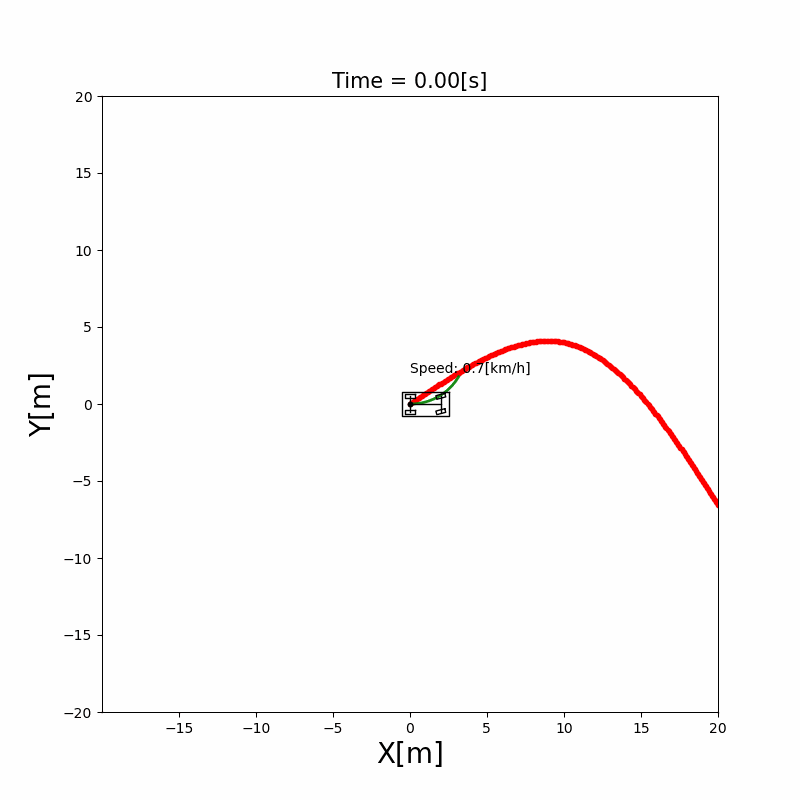

# AMC-AF: Autonomous Vehicle Control in 2D and CARLA

This repository develops and demonstrates autonomous vehicle control in two
simulation environments:

| Simulator | Purpose | Main entry point |
| --- | --- | --- |
| **2D MPC traffic simulator** | Fast controller development and visualization of path tracking with traffic and obstacle constraints | `simulators/2d_mpc/mpc_path_tracking.py` |
| **3D CARLA simulator** | Run a controlled vehicle in a rendered road environment with optional traffic | `simulators/carla_3d/custom_controller_runner.py` |

The runnable simulator programs are kept in `simulators/`. Reusable vehicle,
course, obstacle, and controller implementations are kept separately in
`src/av_control_guide/src/components/`.

## Repository Structure

```text
amcaf/
|-- simulators/
|   |-- 2d_mpc/
|   |   |-- mpc_path_tracking.py          # 2D city traffic MPC simulation
|   |   `-- mpc_path_tracking.gif         # Example output
|   `-- carla_3d/
|       `-- custom_controller_runner.py   # CARLA client/controller runner
|-- src/
|   `-- av_control_guide/
|       |-- src/components/               # Shared algorithms and models
|       |-- src/simulations/              # Additional reference examples
|       `-- test/                         # Algorithm tests
|-- third_party/
|   `-- CARLA_0.9.15/                     # Local CARLA runtime, not committed
|-- requirements.txt
`-- README.md
```

`third_party/CARLA_0.9.15/` is a local installation of the CARLA simulator.
It contains large downloaded engine assets and binaries, so it is ignored by
Git. The project-owned CARLA controller is tracked in `simulators/carla_3d/`.

## Requirements

- Ubuntu 22.04 or a compatible Linux distribution
- Python 3.10 or later for the Python simulations
- A desktop environment for the Matplotlib 2D window
- Vulkan-capable graphics drivers for CARLA
- CARLA `0.9.15` for the 3D workflow

Set up the Python dependencies from the repository root:

```bash
python3 -m venv .venv
source .venv/bin/activate
python3 -m pip install --upgrade pip
python3 -m pip install -r requirements.txt
```

For the CARLA workflow, the Python interpreter also needs a CARLA Python API
package compatible with the installed CARLA version. Confirm it with:

```bash
python3 -c "import carla; print(carla.__file__)"
```

## Run The 2D Simulator

The 2D simulator presents a city-road scene with an ego vehicle, moving
traffic, intersections, and MPC obstacle constraints.

From the repository root:

```bash
python3 simulators/2d_mpc/mpc_path_tracking.py
```

The simulation opens an interactive Matplotlib window. The executable scenario
is in `simulators/2d_mpc/mpc_path_tracking.py`; its reusable MPC, vehicle, and
course logic comes from `src/av_control_guide/src/components/`.



### Publish MPC Commands To Hardware

The 2D simulator can optionally publish its MPC output as
`rc_msgs/msg/AckermannCommand` on `/mpc/ackermann_command`. The guarded
hardware bridge in `crsf_ros2` maps steering angle, route speed, and braking
acceleration to bounded RC PWM output on `/drone/rc_command`.

This mode drives hardware using the simulator's simulated ego pose and
simulated obstacles. It is suitable for restrained actuator integration tests,
not autonomous road operation; real closed-loop driving needs measured vehicle
state and obstacle inputs connected to the controller.

Build and source the hardware ROS workspace:

```bash
cd hardware
colcon build --packages-select rc_msgs crsf_msgs crsf_ros2
source install/setup.bash
```

Start the CRSF node in one sourced terminal:

```bash
ros2 run crsf_ros2 crsf_ros
```

Start the simulator command publisher in another sourced terminal:

```bash
python3 simulators/2d_mpc/mpc_path_tracking.py --publish-control
```

With driven wheels securely restrained, inspect the PWM mapping and then run
the guarded actuator bridge:

```bash
ros2 run crsf_ros2 mpc_actuator --dry-run
ros2 run crsf_ros2 mpc_actuator --confirm-propulsion-safe
```

`mpc_actuator` stops, centers steering, and requests disarming when command
messages become stale. By default its speed mapping is `0 km/h -> 1500` and
`40 km/h -> 1700`; use `--max-speed-kph` and `--forward-pwm` to change that
calibration. PWM is open-loop output, so confirm the actual physical speed
under controlled testing before driving. Steering and braking endpoints such
as `--left-pwm`, `--right-pwm`, and `--reverse-pwm` also require calibration.

## Run The 3D CARLA Simulator

### 1. Install CARLA Locally

Download or extract the CARLA `0.9.15` Linux distribution into this location:

```text
third_party/CARLA_0.9.15/
```

The directory should contain `CarlaUE4.sh` and `CarlaUE4/`.

### 2. Start The CARLA Server

In terminal 1, from the repository root:

```bash
cd third_party/CARLA_0.9.15
./CarlaUE4.sh -quality-level=Low
```

CARLA `0.9.15` uses Vulkan on desktop platforms. Do not launch it with
`-opengl`; that option produces the OpenGL warning and CARLA switches to
Vulkan.

On a hybrid laptop, CARLA can be sent to the NVIDIA GPU with:

```bash
cd third_party/CARLA_0.9.15
__NV_PRIME_RENDER_OFFLOAD=1 __VK_LAYER_NV_optimus=NVIDIA_only ./CarlaUE4.sh -quality-level=Low
```

### 3. Start The Controller Client

In terminal 2, from the repository root:

```bash
python3 simulators/carla_3d/custom_controller_runner.py --road-only
```

Useful variants:

```bash
# Use the shared MPC controller rather than the default example controller.
python3 simulators/carla_3d/custom_controller_runner.py --road-only --controller mpc

# Keep normal town map layers instead of generating the minimal road mesh.
python3 simulators/carla_3d/custom_controller_runner.py --road-only --road-only-mode layers

# Run without background traffic.
python3 simulators/carla_3d/custom_controller_runner.py --road-only --traffic-vehicles 0
```

To implement a new CARLA controller, edit `CustomRoadController.update()` in
`simulators/carla_3d/custom_controller_runner.py`. It receives vehicle state
and returns steering angle in radians and acceleration in metres per second
squared.

## Shared Components

Both workflows are intentionally organized around reusable implementation
modules:

| Location | Contents |
| --- | --- |
| `src/av_control_guide/src/components/control/` | MPC and other control algorithms |
| `src/av_control_guide/src/components/vehicle/` | Vehicle model and specification |
| `src/av_control_guide/src/components/course/` | Reference-course generation |
| `src/av_control_guide/src/components/obstacle/` | Traffic/obstacle representation |
| `src/av_control_guide/src/components/visualization/` | Metrics and display helpers |

Additional educational simulation examples from the underlying control guide
remain in `src/av_control_guide/src/simulations/`; the two primary project
demonstrations are exposed at the top level in `simulators/`.

## Troubleshooting

- **`ModuleNotFoundError: carla`:** install a CARLA Python API package matching
  CARLA `0.9.15` and the Python interpreter used to start the runner.
- **CARLA displays an OpenGL warning:** remove `-opengl` from the
  `CarlaUE4.sh` command; use the Vulkan command above.
- **CARLA client cannot connect:** start `CarlaUE4.sh` first and leave it
  running while launching `custom_controller_runner.py`.
- **The 2D script reports missing packages:** activate `.venv` and reinstall
  `requirements.txt`.

## Attribution

The reusable Python algorithm examples are based on Shisato Yano's
AutonomousVehicleControlBeginnersGuide. Project integration and simulator
scenarios are maintained by Dhruv Dabur and Nishu Gupta.
