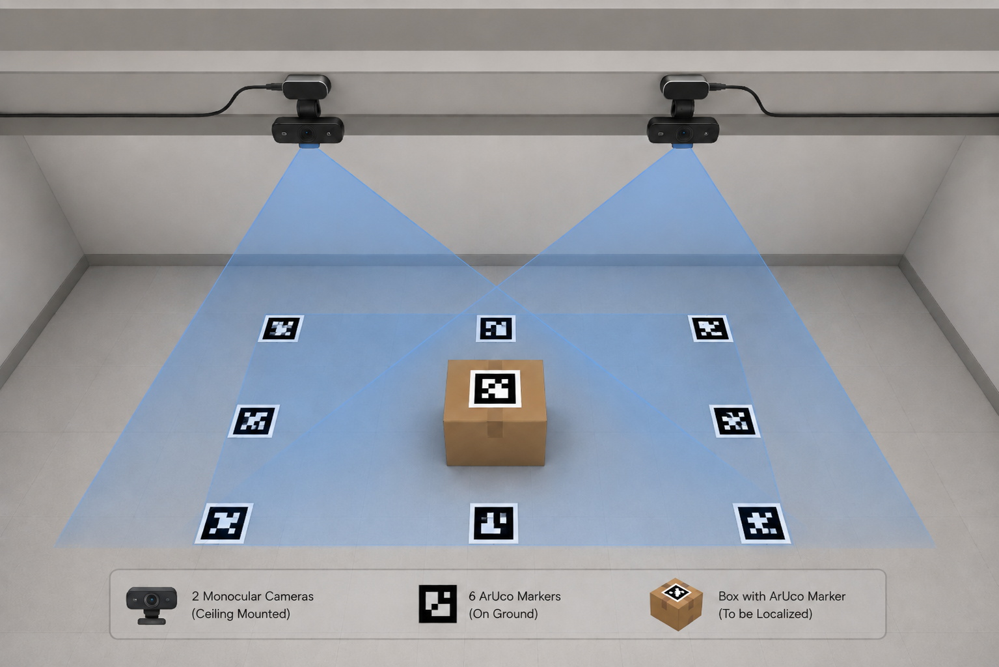
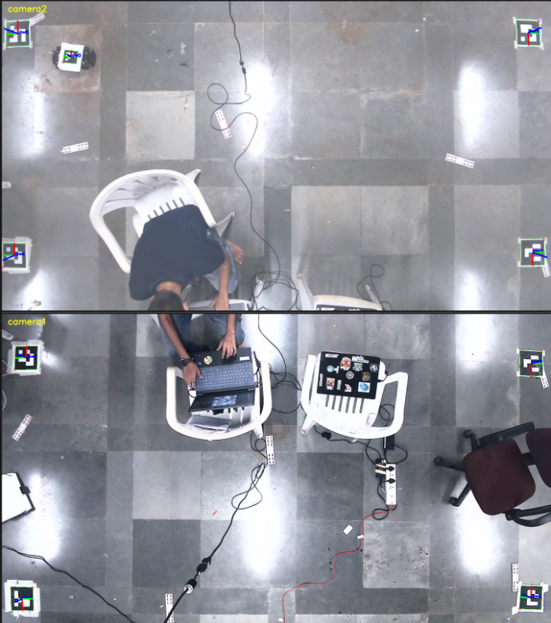

# Monocular Merge

`monocular_merge` estimates a shared 2D/3D ArUco marker layout from two
monocular camera streams. It uses overlap markers seen by both cameras to merge
their detections into one coordinate frame, then reports the target marker pose.

## What It Does

- reads camera intrinsics from `camera_calibration/cam1.yaml` and
  `camera_calibration/cam2.yaml`
- optionally reads camera capture settings from `cam1_settings.yaml` and
  `cam2_settings.yaml`
- detects OpenCV ArUco markers, defaulting to `DICT_4X4_50`
- expects camera 1 to see marker IDs `1,2,3,4`
- expects camera 2 to see marker IDs `3,4,5,6`
- uses shared IDs `3,4` to estimate the camera-to-camera transform
- treats marker ID `4` as the layout origin
- reports marker ID `0` as the target pose when visible

The default marker side length is `0.20 m`.

## Visual Overview

Conceptual two-camera setup:



Live stacked camera view with detected ArUco axes:



## Run

From the repository root:

```bash
python3 -m monocular_merge.aruco_merge \
  --intrinsics1 camera_calibration/cam1.yaml \
  --intrinsics2 camera_calibration/cam2.yaml \
  --settings1 camera_calibration/cam1_settings.yaml \
  --settings2 camera_calibration/cam2_settings.yaml \
  --marker-size-m 0.20 \
  --dictionary DICT_4X4_50
```

For a one-shot JSON result:

```bash
python3 -m monocular_merge.aruco_merge \
  --intrinsics1 camera_calibration/cam1.yaml \
  --intrinsics2 camera_calibration/cam2.yaml \
  --once \
  --json \
  --output-json monocular_merge/latest_pose.json
```

## Coordinate Frames

OpenCV estimates every marker pose as `T_camera_marker`, meaning points in the
marker frame are transformed into the camera frame.

For each shared marker, the merge estimates:

```text
T_camera1_camera2 = T_camera1_shared_marker * inverse(T_camera2_shared_marker)
```

Camera 2 detections are transformed into camera 1 space, then the configured
marker layout is used to express marker poses in the layout frame. The primary
target output is marker `0` relative to that merged layout.

## Calibration Notes

Good results depend on matching the calibration files to the exact camera,
resolution, focus, and lens settings used at runtime. If the frame size changes,
the intrinsics are scaled to the captured frame dimensions, but recalibrating at
the final operating resolution is still preferred.

Install `opencv-contrib-python` if `cv2.aruco` is unavailable.
